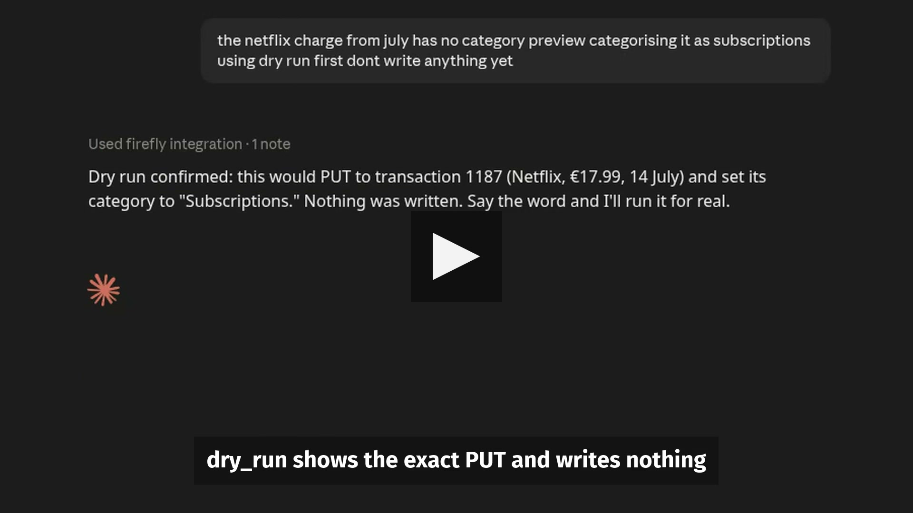

# Firefly III MCP Sunucusu

[](https://www.npmjs.com/package/@yakupemreyerli/firefly-mcp)
[](https://github.com/YakupEmreYerli/mcp-firefly-iii/actions/workflows/ci.yml)
[](LICENSE)
[](https://registry.modelcontextprotocol.io/v0.1/servers/io.github.YakupEmreYerli%2Fmcp-firefly-iii/versions/latest)

[MCP Registry](https://registry.modelcontextprotocol.io/)'de
`io.github.YakupEmreYerli/mcp-firefly-iii` adıyla listelidir.

Kendi [Firefly III](https://www.firefly-iii.org/) örneğinize bir yapay zekâ
asistanının erişmesini sağlar — Model Context Protocol üzerinden, okuma, yazma
ve silme işlemlerini ayrı ayrı yetkilendirilmiş üç ayrı yüzeyde tutarak, hepsini
birden yapabilen tek bir araç yerine.

> English: [README.md](README.md)

- *"Geçen ay en çok neye harcadım?"*
- *"Ağustos'taki kategorisiz işlemleri bul, kategori öner."*
- *"Tutarı artan abonelikleri göster."*

152 Firefly operasyonu, 5 MCP aracı olarak sunulur. Her yazma işlemi `dry_run`
destekler; kayıt silmek ya da bir alanı birçok kayıtta birden değiştirmek gibi
geri alınamaz işlemler kendi yetkisinin arkasında durur — yalnızca
`firefly:read` verilmiş bir bağlantı bu araçları hiç görmez.

Herkes **kendi** Firefly örneğine, **kendi** token'ıyla bağlanır — arada
barındırılan bir sunucu ya da aktarıcı yoktur. Yanıtı aldıktan sonra
bağladığınız yapay zekâ istemcisinin veya modelin onunla ne yaptığı bu
sunucunun kontrolü dışındadır.

## Demo

[](docs/assets/demo.mp4)

**38 saniyelik demo:** finansal bir soru sor, cevabı MCP üzerinden oku,
değişikliği `dry_run` ile önizle, onayla ve Firefly III'e yaz.

Claude Desktop'ta, sentetik bir Firefly III örneğine karşı kaydedildi.
Demoda görünen tüm finansal veriler uydurmadır.

## Neden beş araç?

Firefly III'ün API'si geniş. Her uca kendi MCP aracını vermek modelin önüne
152 ayrı araç koymak demek olurdu — bu düz katalog büyüdükçe context'e mal
olur ve bir MCP istemcisinin seçim yapmasını zorlaştırır.

```
152 Firefly operasyonu
        │
        ▼
   typed operation registry
        │
        ▼
    5 MCP meta-tool
        │
        ▼
    yapay zekâ istemciniz
```

Okuma, yazma ve silme işlemleri tek bir genel giriş noktasında birleşmek yerine
ayrı araçlarda kalır; böylece bir host — ya da yetki kapsamı sınırlı bir OAuth
bağlantısı — her birine farklı bir politika uygulayabilir, hem de aracı seçim
adımına kataloğun tamamını hiç yüklemeden.

## Güvenlik ve kontrol

- **Tek bir açık/kapalı anahtar değil, kapsamlı erişim.** stdio üzerinde sınır
  Firefly token'ının kendisidir — yalnızca soru cevaplayan bir oturum
  isterseniz salt-okunur bir Personal Access Token üretin, çünkü sunucunun
  kendi izin ayarı yok. HTTP üzerinde OAuth ile `firefly:read`,
  `firefly:write` ve `firefly:destructive` bağlantı başına, onay ekranında
  verilir; verilmeyen yüzey hem gizlenir hem de reddedilir.
- **Her yazmada `dry_run`.** Bir yazma veya toplu işlem çalışmadan önce
  `dry_run: true`, gönderilecek isteği — çözülmüş kayıt id'leriyle birlikte —
  hiç göndermeden aynen döndürür.
- **Toplu yazmalar körlemesine çalışamaz.** Filtreyle çalışan bir toplu
  güncelleme `max_matches` ister; tarama bu sayıdan fazla satır bulursa, ya da
  Firefly'ın sayfalama meta'sı taramanın tam bittiğini doğrulamazsa, işlem ilk
  yazımdan önce durur. Çok parçalı işlem gruplarını, tutarlarını sessizce
  katlayabilecek toplu operasyonlar tamamen reddeder — tek bir işlemi
  değiştirmek için `update` kullanılır.
- **Uzak mod şartsız açılmaz.** Uzak HTTP, sabit bir bearer token ile ya da
  bağlantı başına yetki kapsamı gerekiyorsa gömülü OAuth ile çalışabilir.
  Token modunda sunucu `MCP_HTTP_TOKEN` olmadan başlamayı reddeder, `/mcp`'ye
  gelen her istek `Authorization: Bearer <token>` taşımak zorundadır.
- **Bunun kapsamadığı şey:** bu sunucu verinizi üçüncü bir tarafa göndermez,
  ama bağladığınız yapay zekâ istemcisinin veya modelin, eline geçen yanıtla
  ne yapacağını kontrol etmez — bu, sunucunun değil, istemcinizin özelliğidir.

Tam tehdit modeli
[SECURITY.md](https://github.com/YakupEmreYerli/mcp-firefly-iii/blob/main/SECURITY.md)'de.

## Hızlı Başlangıç

Node.js 20.6+ gerekir. En kısa yol, kurulumu ona bırakmak:

```bash
npx -y @yakupemreyerli/firefly-mcp setup
```

Firefly III adresinizi ve API token'ınızı sorar, **gerçekten çalışıp
çalışmadıklarını** örneğinize karşı sınar, sonra bulursa Claude Code ve Claude
Desktop'ı yapılandırır — dokunduğu her dosyanın yedeğini alır ve diğer MCP
sunucularınıza ilişmez. Başka bir istemci kullanıyorsanız yapıştırmanız için
yapılandırmayı ekrana basar.

Elle yapmayı tercih ederseniz:

### Claude Code

```bash
claude mcp add firefly \
  --env FIREFLY_API_URL=kendi-firefly-adresiniz \
  --env FIREFLY_API_TOKEN=token-degeriniz \
  -- npx -y @yakupemreyerli/firefly-mcp
```

### Claude Desktop, Cursor ve diğer istemciler

İstemcinin MCP yapılandırma dosyasına ekleyin:

```json
{
  "mcpServers": {
    "firefly": {
      "command": "npx",
      "args": ["-y", "@yakupemreyerli/firefly-mcp"],
      "env": {
        "FIREFLY_API_URL": "kendi-firefly-adresiniz",
        "FIREFLY_API_TOKEN": "token-degeriniz"
      }
    }
  }
}
```

Token'ı Firefly III → **Options → Profile → OAuth → Create New Personal Access
Token** yolundan alırsınız. URL için alan adınız yeterli — `https://` ve
`/api/v1` tamamlanır. Örneğiniz bir alt yolda, özel bir portta ya da düz
http üzerindeyse tam URL'i verin.

## Asistanın gördüğü yüzey

Beş meta-tool'un tamamı — çalıştırma riske göre bölünmüş, böylece istemci
bakiye okumakla işlem silmeyi ayırt edebiliyor:

| Araç | Cevapladığı soru | Risk |
| --- | --- | --- |
| `firefly_query` | Her şeyi oku. Açıklaması kataloğu taşır, seçim ek bir çağrıya mal olmaz. | salt-okunur |
| `firefly_mutate` | Kayıt oluştur veya değiştir. | yazar |
| `firefly_destructive` | Kayıt sil, ya da tek çağrıda çok kaydın bir alanını değiştir. | geri alınamaz |
| `firefly_list_operations` | Bu varlıkla ne yapabilirim? | salt-okunur |
| `firefly_get_schema` | Bu operasyon hangi parametreleri alıyor? | salt-okunur |

Her birinde MCP tool annotation'ları var (`readOnlyHint`, `destructiveHint`,
`idempotentHint`) ve ayrım yalnızca ilan edilmiyor, **uygulanıyor**:
`firefly_query` üzerinden çağrılan bir silme reddedilir. Yalnızca `firefly:read`
verilmiş bir bağlantı, yazan iki aracı hiç görmez.

Yanıtlar modele ulaşmadan kırpılır: boş ve null alanlar her zaman düşer,
çalıştırma araçlarının hepsi, yalnızca adını verdiğiniz alanları tutan bir `fields`
listesi alır — büyük bir işlem listesinde bu yaklaşık %90 küçülme demektir.

## Yapılandırma

| Değişken | Varsayılan | İşlevi |
| --- | --- | --- |
| `FIREFLY_API_URL` | — | Zorunlu. Yalnızca alan adı, ya da `/api/v1` dahil tam URL. |
| `FIREFLY_API_TOKEN` | — | Zorunlu. Personal Access Token. |
| `FIREFLY_DISABLE_SSL_VERIFY` | `false` | Yalnızca kendinden imzalı sertifikalı yerel örnek için. |

## Uzak HTTP modu

Süreç başlatmak yerine HTTP üzerinden bağlanan istemciler için — örneğin n8n —
aynı sunucu streamable HTTP konuşur:

```bash
export MCP_HTTP_TOKEN=$(openssl rand -hex 32)
npx -y -p @yakupemreyerli/firefly-mcp firefly-mcp-http
```

`firefly-mcp-http`, aynı paketin içindeki ikinci bir çalıştırılabilirdir; `npx`
bu yüzden `-p` ile paketi ve komutu ayrı ayrı ister.

`MCP_HTTP_TOKEN` verilmeden başlamaz ve `/mcp` uçlarına gelen her istek
`Authorization: Bearer <token>` taşımak zorundadır. `/health` açıktır, container
probe'ları içindir. Depoda bir `Dockerfile` ve `compose.example.yml` bulunur.

TLS arkasına koyun. Bu token, internet ile finansal geçmişinize yazma erişimi
arasındaki tek şey — portu doğrudan açmayın.

## Dokümantasyon

| Sayfa | İçeriği |
| --- | --- |
| [Quickstart](https://github.com/YakupEmreYerli/mcp-firefly-iii/blob/main/docs/quickstart.md) | Token alma, istemciyi bağlama, ilk denemeler, sorun giderme |
| [Configuration](https://github.com/YakupEmreYerli/mcp-firefly-iii/blob/main/docs/configuration.md) | Tüm ortam değişkenleri, izin politikası, HTTP modu |
| [MCP Integration](https://github.com/YakupEmreYerli/mcp-firefly-iii/blob/main/docs/integrations.md) | Claude Code, Claude Desktop, Cursor, VS Code, n8n ve uzak HTTP |
| [Operations](https://github.com/YakupEmreYerli/mcp-firefly-iii/blob/main/docs/api/operations.md) | 152 operasyonun tamamı, yanıt kırpma, Firefly'ın tuzakları |
| [Analysis Operations](https://github.com/YakupEmreYerli/mcp-firefly-iii/blob/main/docs/api/analysis.md) | `summary.overview`, arama ve sekiz insight ucu |
| [MCP Inspector](https://github.com/YakupEmreYerli/mcp-firefly-iii/blob/main/docs/development/mcp-inspector.md) | Geliştirirken sunucuyu interaktif kurcalama |

Dokümantasyon sayfaları İngilizcedir.

## Docker

HTTP modu için hazır imaj var, `linux/amd64` ve `linux/arm64` için:

```bash
docker run -d \
  -e FIREFLY_API_URL=kendi-firefly-adresiniz \
  -e FIREFLY_API_TOKEN=token-degeriniz \
  -e MCP_HTTP_HOST=0.0.0.0 \
  -e MCP_HTTP_TOKEN="$(openssl rand -hex 32)" \
  -p 3000:3000 \
  ghcr.io/yakupemreyerli/mcp-firefly-iii:latest
```

`/health` token istemez, container probe'ları içindir. `/mcp` üzerindeki her
şey `Authorization: Bearer <MCP_HTTP_TOKEN>` ister.

Bağımlı olduğunuz bir yerde `:latest` yerine bir sürüm etiketi sabitleyin
([releases sayfasına](https://github.com/YakupEmreYerli/mcp-firefly-iii/releases)
bakın — örneğin `:v1.1.1`).

## Geliştirme

```bash
git clone https://github.com/YakupEmreYerli/mcp-firefly-iii.git
cd mcp-firefly-iii
npm install
cp .env.example .env    # kendi örneğinizi girin
npm test                # mock'lu; canlı örneğe hiç dokunmaz
npm run build
npm run check           # .env'deki örneğe salt-okunur bağlantı kontrolü
```

## Katkı

Hata bildirimleri ve pull request'ler açığa. Kodun düzeni, testlerin nasıl
çalıştırılacağı ve dokunmadan önce bilinmesi gereken Firefly III tuhaflıkları
için [CONTRIBUTING.md](https://github.com/YakupEmreYerli/mcp-firefly-iii/blob/main/CONTRIBUTING.md).

Güvenlik açığı bulduysanız lütfen özel olarak bildirin —
[SECURITY.md](https://github.com/YakupEmreYerli/mcp-firefly-iii/blob/main/SECURITY.md).

## Lisans

MIT — bkz. [LICENSE](https://github.com/YakupEmreYerli/mcp-firefly-iii/blob/main/LICENSE).
